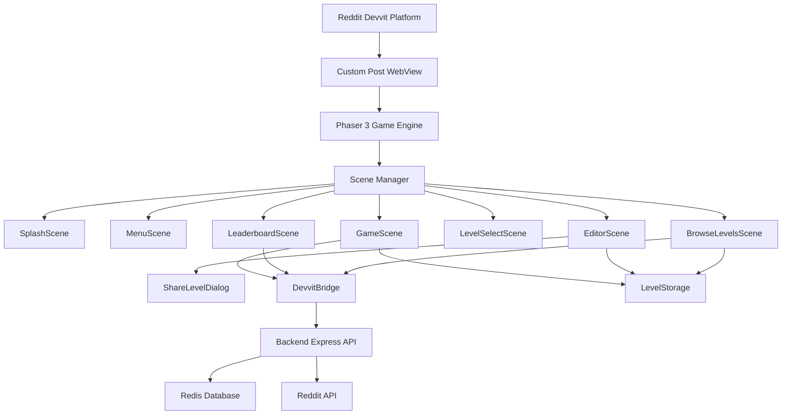
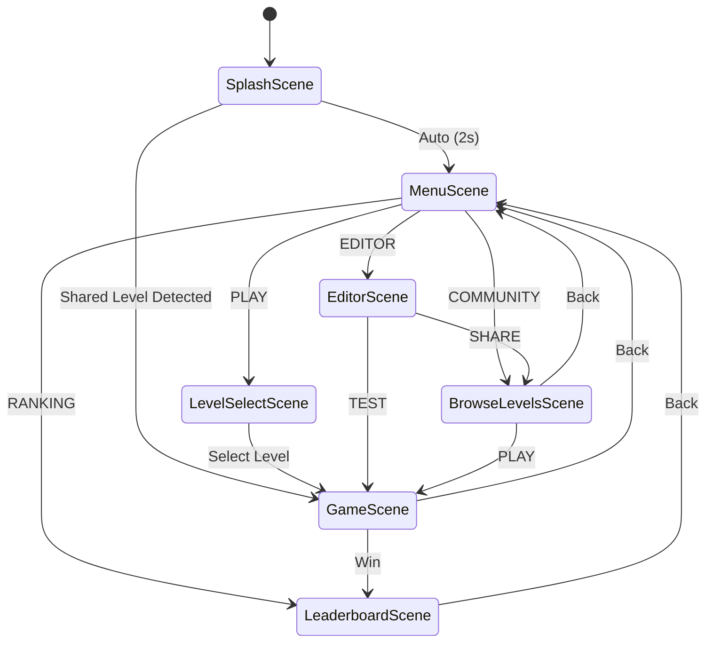
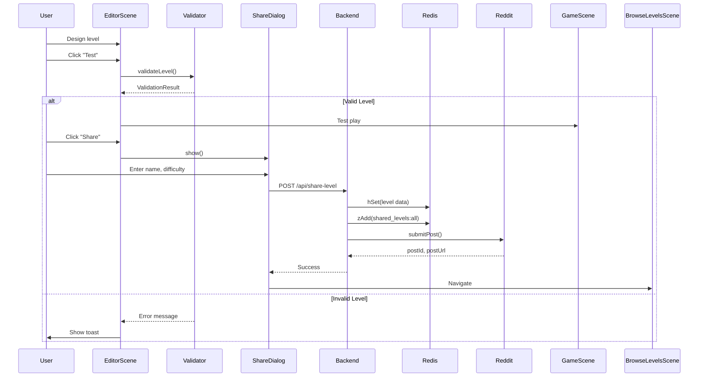
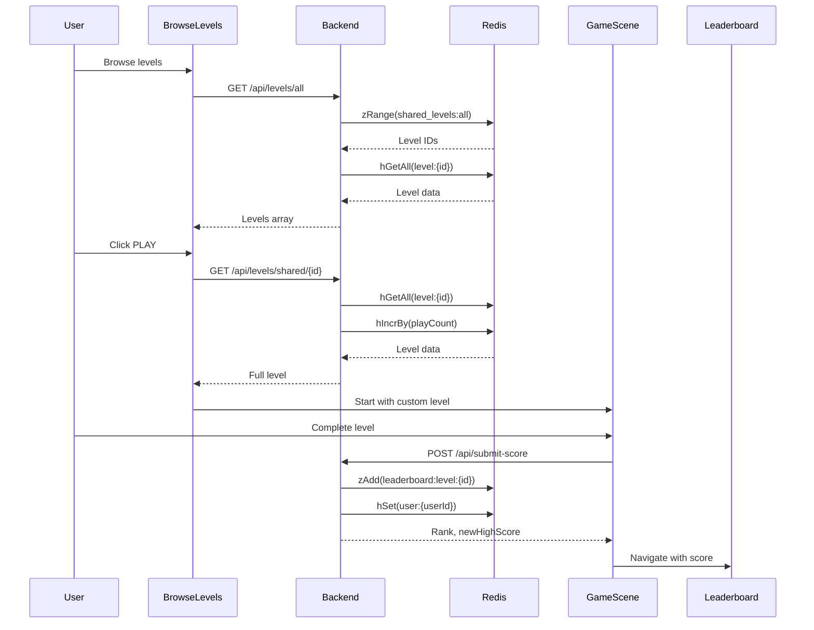

# ASTROCAT - Technical Design Document

## Architecture Overview

### High-Level System Architecture



### Scene Flow Diagram



## TypeScript Data Structures

### Core Interfaces

```typescript
/**
 * Represents a complete level with all gameplay data
 */
interface LevelData {
    /** Unique identifier (format: "level:timestamp:userId" for shared levels) */
    id: string;
    
    /** Display name of the level */
    name: string;
    
    /** Number of rows in pyramid (1-10) */
    rows: number;
    
    /** Map of block positions to block types */
    cubes: Map<string, BlockType>;
    
    /** Array of enemy spawn positions and types */
    enemies: EnemyData[];
    
    /** Player spawn position (row, col) */
    spawn: { row: number; col: number };
    
    /** Goal position (row, col) */
    goal: { row: number; col: number };
    
    /** Creator's Reddit username */
    creator: string;
    
    /** Creator's Reddit userId (t2_xxxxx) */
    creatorId: string;
    
    /** Difficulty level */
    difficulty: 'easy' | 'medium' | 'hard';
    
    /** Unix timestamp of creation */
    timestamp: number;
    
    /** Optional description */
    description?: string;
}

/**
 * Block types with numeric identifiers matching sprite atlas
 */
enum BlockType {
    VOID = -1,      // Empty space (player falls)
    NORMAL = 0,     // Standard cube (gray → green when visited)
    TRAP = 1,       // Instant death on contact (red)
    SPECIAL = 2,    // Bonus points (blue)
    TRAMPOLINE = 3, // Bounces player 2 cubes (orange)
    ICE = 4,        // Slippery (white)
    STICKY = 5,     // Slower movement (purple)
    GOAL = 6,       // Win condition (yellow)
}

/**
 * Enemy data for level
 */
interface EnemyData {
    /** Position in grid */
    position: { row: number; col: number };
    
    /** Enemy behavior type */
    type: 'patrol' | 'chase' | 'stationary';
    
    /** Movement speed multiplier */
    speed: number;
}

/**
 * Phaser game configuration
 */
interface GameConfig extends Phaser.Types.Core.GameConfig {
    width: number;           // Canvas width
    height: number;          // Canvas height
    scale: ScaleConfig;      // Responsive scaling
    physics: PhysicsConfig;  // Arcade physics
    scenes: typeof Phaser.Scene[];
}

/**
 * Responsive scale configuration
 */
interface ScaleConfig {
    mode: Phaser.Scale.ScaleModes;
    autoCenter: Phaser.Scale.Center;
    width: number;
    height: number;
    min: { width: number; height: number };
    max: { width: number; height: number };
}

/**
 * Level validation result
 */
interface ValidationResult {
    isValid: boolean;
    errors: string[];
    warnings: string[];
    pathExists?: boolean;
    pathLength?: number;
}

/**
 * Leaderboard entry
 */
interface LeaderboardEntry {
    rank: number;
    username: string;
    userId: string;
    score: number;
    gamesPlayed: number;
    gamesWon: number;
    lastUpdated: number;
}

/**
 * Shared level metadata for browsing
 */
interface SharedLevelMeta {
    id: string;
    name: string;
    creator: string;
    difficulty: 'easy' | 'medium' | 'hard';
    playCount: number;
    averageRating: number;
    ratingCount: number;
    createdAt: number;
    postId: string;
    postUrl: string;
}
```

## Component Design

### 1. EditorScene Architecture

```typescript
class EditorScene extends Phaser.Scene {
    // Grid state
    private gridData: Map<string, BlockType>;
    private gridSprites: Map<string, Phaser.GameObjects.Sprite>;
    private gridSize: number = 7; // Default pyramid rows
    
    // UI Panels
    private topPanel: Phaser.GameObjects.Container;
    private rightPanel: Phaser.GameObjects.Container;
    private bottomPanel: Phaser.GameObjects.Container;
    
    // Selection state
    private selectedTool: 'block' | 'enemy' | 'goal' | 'spawn';
    private selectedBlockType: BlockType;
    
    // Preview
    private previewSprite: Phaser.GameObjects.Sprite;
    
    create() {
        this.createPanels();
        this.createGrid();
        this.setupInputHandlers();
        this.loadLocalLevel(); // Restore from localStorage
    }
    
    /**
     * Validates level using BFS pathfinding
     * Returns true if goal is reachable from spawn
     */
    private validateLevel(): ValidationResult {
        const queue: Position[] = [this.spawnPosition];
        const visited = new Set<string>();
        
        while (queue.length > 0) {
            const current = queue.shift()!;
            const key = `${current.row}_${current.col}`;
            
            if (visited.has(key)) continue;
            visited.add(key);
            
            // Check if reached goal
            if (current.row === this.goalPosition.row && 
                current.col === this.goalPosition.col) {
                return { isValid: true, errors: [], warnings: [], pathExists: true };
            }
            
            // Add neighbors (4 directions in isometric grid)
            const neighbors = this.getNeighbors(current);
            queue.push(...neighbors.filter(n => this.gridData.has(`${n.row}_${n.col}`)));
        }
        
        return { 
            isValid: false, 
            errors: ['Goal is unreachable from spawn point'],
            warnings: [],
            pathExists: false 
        };
    }
}
```

### 2. GameScene Architecture

```typescript
class GameScene extends Phaser.Scene {
    // Level state
    private currentLevel: LevelData;
    private isCustomLevel: boolean = false;
    
    // Player
    private player: Phaser.GameObjects.Sprite;
    private playerPosition: { row: number; col: number };
    private lives: number = 3;
    
    // Blocks
    private blocks: Map<string, Phaser.GameObjects.Sprite>;
    private visitedBlocks: Set<string>;
    
    // Enemies
    private enemies: Enemy[] = [];
    
    // Score
    private score: number = 0;
    private timeElapsed: number = 0;
    
    init(data: { levelData?: LevelData; levelIndex?: number }) {
        if (data.levelData) {
            this.currentLevel = data.levelData;
            this.isCustomLevel = true;
        } else {
            this.currentLevel = PREDEFINED_LEVELS[data.levelIndex || 0];
        }
    }
    
    create() {
        this.generatePyramid();
        this.createPlayer();
        this.createEnemies();
        this.createHUD();
        this.setupInputHandlers();
    }
    
    update(time: number, delta: number) {
        this.timeElapsed += delta;
        this.updateEnemies(delta);
        this.checkWinCondition();
        this.updateHUD();
    }
    
    /**
     * Handles player movement in isometric grid
     */
    private movePlayer(direction: 'up' | 'down' | 'left' | 'right') {
        const targetPos = this.calculateTargetPosition(direction);
        
        if (!this.isValidMove(targetPos)) return;
        
        // Smooth tween to target
        this.tweens.add({
            targets: this.player,
            x: this.isoToScreen(targetPos).x,
            y: this.isoToScreen(targetPos).y,
            duration: 300,
            ease: 'Cubic.easeOut',
            onComplete: () => {
                this.onPlayerLanded(targetPos);
            }
        });
    }
    
    /**
     * Convert isometric grid coords to screen pixels
     */
    private isoToScreen(pos: { row: number; col: number }): { x: number; y: number } {
        const tileW = 120;
        const tileH = 60;
        
        return {
            x: (pos.col - pos.row) * (tileW / 2) + centerX,
            y: (pos.col + pos.row) * (tileH / 2) + centerY
        };
    }
}
```

### 3. BrowseLevelsScene Architecture

```typescript
class BrowseLevelsScene extends Phaser.Scene {
    private levels: SharedLevelMeta[] = [];
    private levelCards: Phaser.GameObjects.Container[] = [];
    private scrollY: number = 0;
    private autoRefreshTimer?: Phaser.Time.TimerEvent;
    
    create() {
        this.createBackground();
        this.createHeader();
        this.fetchLevels();
        this.setupAutoRefresh();
    }
    
    /**
     * Fetches community levels from backend
     */
    private async fetchLevels() {
        try {
            const response = await fetch('/api/levels/all?limit=50');
            const data = await response.json();
            
            if (data.success && data.levels) {
                this.levels = data.levels;
                this.displayLevels();
            }
        } catch (error) {
            console.error('Failed to fetch levels:', error);
            this.showError('Failed to load community levels');
        }
    }
    
    /**
     * Creates scrollable card list
     */
    private displayLevels() {
        this.clearCards();
        
        this.levels.forEach((level, index) => {
            const card = this.createLevelCard(level, index);
            this.levelCards.push(card);
        });
    }
    
    /**
     * Auto-refresh every 10 seconds
     */
    private setupAutoRefresh() {
        this.autoRefreshTimer = this.time.addEvent({
            delay: 10000,
            callback: () => this.fetchLevels(),
            loop: true
        });
    }
}
```

## Data Flow Patterns

### Level Creation Flow



### Level Playing Flow



## Backend API Design

### Endpoints Specification

#### 1. POST /api/share-level
**Purpose:** Share level to Reddit and save to Redis

**Request:**
```typescript
{
    levelData: LevelData;
    levelName: string;
    difficulty: 'easy' | 'medium' | 'hard';
    description?: string;
}
```

**Response:**
```typescript
{
    success: boolean;
    levelId?: string;      // "level:1730000000000:t2_abc123"
    postId?: string;       // Reddit post ID
    postUrl?: string;      // https://reddit.com/...
    message?: string;
    error?: string;
}
```

**Redis Operations:**
```typescript
// Save level data
await redis.hSet(`level:${levelId}`, {
    name: levelName,
    creator: username,
    creatorId: userId,
    difficulty: difficulty,
    levelData: JSON.stringify(levelData),
    createdAt: Date.now(),
    playCount: 0,
    totalRating: 0,
    ratingCount: 0
});

// Add to global index (sorted by timestamp)
await redis.zAdd('shared_levels:all', {
    score: Date.now(),
    member: levelId
});
```

#### 2. GET /api/levels/all
**Purpose:** Browse all shared levels with pagination

**Query Params:**
- `page` (default: 0)
- `limit` (default: 20)

**Response:**
```typescript
{
    success: boolean;
    levels: SharedLevelMeta[];
    pagination: {
        page: number;
        limit: number;
        total: number;
    }
}
```

#### 3. POST /api/submit-score
**Purpose:** Submit score to leaderboard

**Request:**
```typescript
{
    score: number;
    levelId: string;  // 'global' or specific level ID
    username?: string;
}
```

**Response:**
```typescript
{
    success: boolean;
    newHighScore: boolean;
    rank: number;
    score: number;
}
```

#### 4. GET /api/leaderboard/:type
**Purpose:** Get leaderboard rankings

**Params:**
- `type`: 'global' or level ID

**Query:**
- `limit` (default: 10)

**Response:**
```typescript
{
    success: boolean;
    leaderboard: LeaderboardEntry[];
}
```

## Redis Data Schemas

### Level Data (Hash)
```
Key: level:{timestamp}:{userId}

Fields:
- name: string
- creator: string (username)
- creatorId: string (userId)
- difficulty: string
- levelData: JSON string
- createdAt: number
- playCount: number
- totalRating: number
- ratingCount: number
- postId: string
- postUrl: string
```

### Leaderboard (Sorted Set)
```
Key: leaderboard:global
Key: leaderboard:level:{levelId}

Members: userId
Scores: player's best score (descending)
```

### User Stats (Hash)
```
Key: user:{userId}

Fields:
- username: string
- bestScore: number
- gamesPlayed: number
- gamesWon: number
- lastUpdated: number
```

### Level Index (Sorted Set)
```
Key: shared_levels:all

Members: level:{timestamp}:{userId}
Scores: createdAt timestamp (descending)
```

## DevvitBridge Communication

### Message Protocol

```typescript
// WebView → Devvit
interface WebViewMessage {
    type: 'SUBMIT_SCORE' | 'SHARE_LEVEL' | 'OPEN_LEADERBOARD' | 'GAME_READY';
    payload: any;
}

// Devvit → WebView
interface DevvitMessage {
    type: 'LOAD_LEVEL' | 'USER_DATA' | 'INIT_COMPLETE';
    payload: any;
}

// Bridge implementation
class DevvitBridge {
    static sendToDevvit(type: string, data: any) {
        window.parent.postMessage(
            { type, data },
            '*' // Reddit origin
        );
    }
    
    static initListener(handlers: Record<string, Function>) {
        window.addEventListener('message', (event) => {
            const { type, data } = event.data;
            if (handlers[type]) {
                handlers[type](data);
            }
        });
    }
}
```

## Performance Optimizations

### 1. Sprite Pooling
```typescript
class SpritePool {
    private pool: Phaser.GameObjects.Sprite[] = [];
    
    get(scene: Phaser.Scene, x: number, y: number, texture: string): Phaser.GameObjects.Sprite {
        let sprite = this.pool.pop();
        
        if (!sprite) {
            sprite = scene.add.sprite(x, y, texture);
        } else {
            sprite.setPosition(x, y).setTexture(texture).setActive(true).setVisible(true);
        }
        
        return sprite;
    }
    
    return(sprite: Phaser.GameObjects.Sprite) {
        sprite.setActive(false).setVisible(false);
        this.pool.push(sprite);
    }
}
```

### 2. Texture Atlas
All sprites packed into single atlas to reduce draw calls:
```
assets/sprites/atlas.json
assets/sprites/atlas.png (2048x2048)

Contains:
- player frames (8)
- block types (7)
- enemies (3 types × 4 frames)
- UI elements (20)
- particles (5)
```

### 3. Scene Reuse
```typescript
// Don't destroy scenes on exit, reuse them
this.scene.start('GameScene', { levelData });  // ❌ Creates new instance

this.scene.sleep('MenuScene');
this.scene.wake('GameScene', { levelData });   // ✅ Reuses existing
```

## Testing Strategy

### Unit Tests (Vitest)
- BFS validation algorithm
- Isometric coordinate conversion
- Score calculation logic
- Level serialization/deserialization

### Integration Tests
- Backend API endpoints
- Redis operations
- DevvitBridge messaging

### Manual Testing Checklist
- [ ] Create level → Test → Share → Browse → Play
- [ ] Complete level → Submit score → View leaderboard
- [ ] Responsive design (320px, 768px, 1920px)
- [ ] Mobile touch controls
- [ ] Edge cases (empty levels, disconnected blocks)

## Deployment Architecture

```
GitHub Repo
  ↓ npm run build
Vite Bundle
  ↓ devvit upload
Reddit Devvit Platform
  ↓ Install in subreddit
Custom Post Type
  ↓ User clicks "Play"
WebView with Phaser Game
```

## Future Enhancements

### Phase 2 Features
- Real-time multiplayer (race mode)
- Level voting system (upvote/downvote)
- Daily challenges with special rewards
- Achievement system
- User profiles with stats

### Technical Debt
- Migrate ASTROCAT/src/ to src/client/game/scenes/
- Add comprehensive unit tests
- Implement sprite pooling across all scenes
- Add error tracking (Sentry integration)
